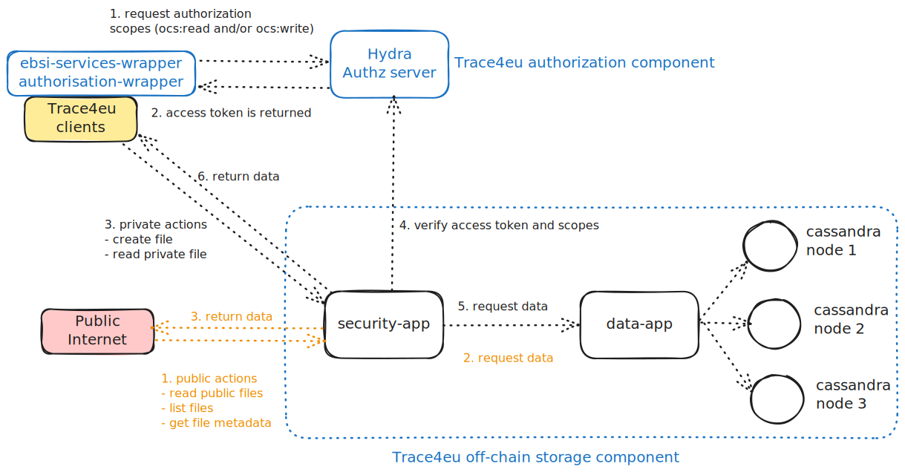

# OCS (off-chain storage) component

It's composed by:


- Apache Cassandra cluster. The documentation about how it is configured and deployed can be found here [here](https://nextcloud.trace4eu.eu/f/81334).  

- data layer ([data-app](data-app)). It's a Java Spring Boot application used for accessing Apache Cassandra database.  

- security layer ([security-app](security-app)). It's a like a proxy that manages the incoming request from the clients.  
  Its access is secure by an OIDC access token. It means that the client should previously get an access token from the [Trace4eu authorization server](https://api-dev-auth.trace4eu.eu/oauth2/token).   
  [Swagger documentation](https://api-dev.trace4eu.eu/trace4eu/off-chain-storage/v1/api-docs#/) is published and accessible.


The following diagram shows how it works:



## How to get an access token

The following library has been developed: https://www.npmjs.com/package/@trace4eu/authorisation-wrapper  
With that library you can get an access token:
```
const did = 'did:ebsi:zfEmvX5twhXjQJiCWsukvQA';
const entityKeys = [
  {
    alg: Algorithm.ES256,
    privateKeyHex:
      '<ecc private key>',
  },
];
const wallet = WalletFactory.createInstance(false, did, entityKeys);
const trace4euAuthorisationApi = new Trace4euAuthorisationApi(wallet);
const tokenResponse = await trace4euAuthorisationApi.getAccessToken('ES256', 'ocs:write');
```

The scopes related to the OCS are:
- `ocs:read`: It allows to read the private files owned by the entity
- `ocs:write`: It allows to write files in the OCS.

Before using the OCS, you need to request access to the T2.2 contributors. They will create the client in the Trace4eu authorisation server, following the script located [here](https://github.com/trace4eu/authorization-and-authentication/blob/main/examples/scenario1/admin.py)  
If you want to make the calls to the Authorization server by your own, you can take this [python script](https://github.com/trace4eu/authorization-and-authentication/blob/main/examples/scenario1/client.py) as an example.
